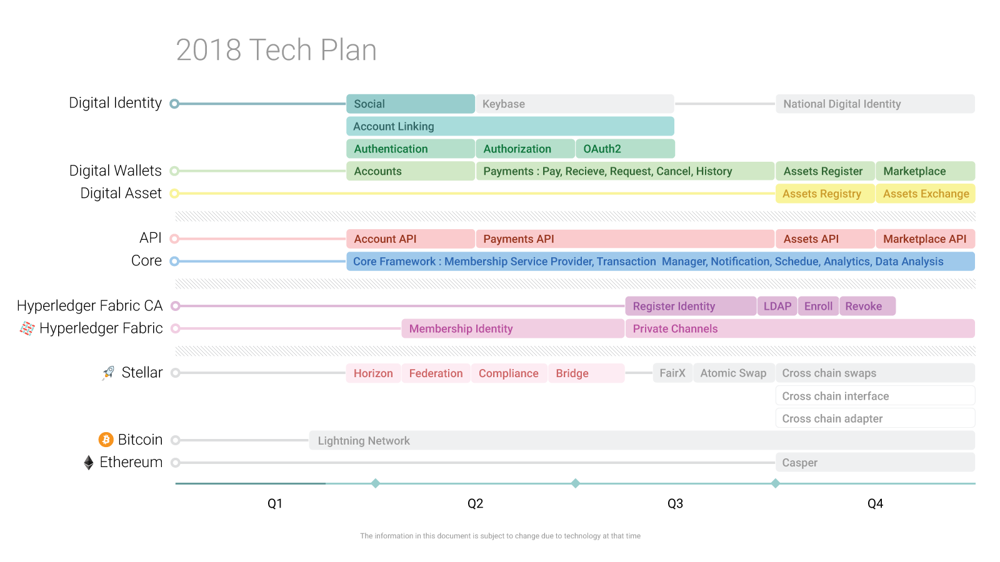

# SIX documentation
This is a draft version of technical specifications, please consider it as a rough idea which will need some evaluation first.

## 2018 Plan and Tech stacks

## Digital Identity
### For 1st state (online)
To welcome existing user we will use `Proof of Social` and `Proof of Authority` concept for identity approval just like `keybase.io` did. And we'll extend further by adding more 3rd party for example `Line`, `Messenger`, `WeChat` and some others through `oauth2` specifications on `Federation Server`.
- `Proof of nothing` (Not logged in) user should able to read only public content.
- `Proof of Social` (Link account with social) user should able to read and write owned data.
- `Proof of Liveness` (Link account with active social) user should able to read and share data with other.
- `Proof of Endore` (Endorsed by others) user should able to interact with other user at limitted rate.

The key concept is the more users social connected mean more trust we give, This also open opportunity for `cross social` payments. Let's say `@alice` on Facebook can pay `@bob` on `Twitter` and `@bob` get notify via `Twitter` when transaction complete.

We'll focus on easiest engagement first for this persona, not much security will apply here and the user will have less permission at this state.

### For 2nd state (online-onchain)
To let the user take care their own privacy we'll separate user levels as declared below.
- `Highest private` preferred user should create and funded their own `XLM` account (all user control).
- `High private` preferred user should generate `XLM` account locally via our wallet with desired user `PIN` (server blind).
- `Regular private` preferred user should let server generate and fund `XLM` account after fiat paid with desired user `PIN` (server blind).
- `Low private` preferred user should let server generate and fund `XLM` then email generated one time `PIN` (server blind).

And we will link user account securely on chain with `Hyperledger Fabric` via `Membership Service`. We will use [W3C standard](https://www.w3.org/TR/verifiable-claims-data-model/#privacy-considerations) to ensure future compatible.

### For 3rd state (offline-online-onchain)
`Federation Server` and `Compliance Server` will apply here, we will use an `Anchor` for handle regulatory, like Anti-Money Laundering (AML). The `Customer DB`, `Sanction DB`, `Compliance DB` and `KYC` process is required for this step.
- `KYC Trust` (Done KYC, 2 Factors) user should able to receive payments.
- `AML Trust` (Pass AML, 2 Factors) user should able to send/request payments.
- `Highest Trust` (KYC, AML, Finger print checked) user should able to change options data.

For the further plan, we willing to support either `National Digital Identity` (Thailand, underdevelopment) and also 3rd party ID (cross chain adapter) when it release and widely used.

The permissions will depend on user states and allowance, The `3rd state` user will have more access to our payments system features depends on regulation at that time, By the way, we won't (and we can't due to a distributed concept) control user activities outside our ecosystems. Our system purpose is only for convenient payments only.

## Digital Wallet
We aim to have web wallet, chatbot wallet, iOS/Android wallet in the plan.

### For alpha version
- Register for new wallet account.
- Has current balance.
- Request `@bob` for some desired token.
- Pay from `@alice` to `@bob`.
- Has payments history.
- Get notifications when wallet's balance changed. (off chain service)

### For beta version
- Has `QR Code` for a request token.
- Has current price against `THB`, `USD`, `XLM`.
- Can set time bound for valid payments.
- Can schedule future payments.
- Can exchange with another chain (TBD).

### For preview version
- Can collect and display issued assets.
- Can exchange issued assets.

## Digital Assets
We will use `Hyperledger Fabric CA` for `Certificate Authority` service which provides features such as:
- Registration of identities, or connects to LDAP as the user registry
- Issuance of Enrollment Certificates (ECerts)
- Certificate renewal and revocation

We will provide `ICO as a Service` base on SIX domain for selected assets for the pilot, and will make it available to others user later.

For further detail for validation process will be discussed and announce later.

## Disclaimer
The information in this document is subject to change due to technology at that time.
